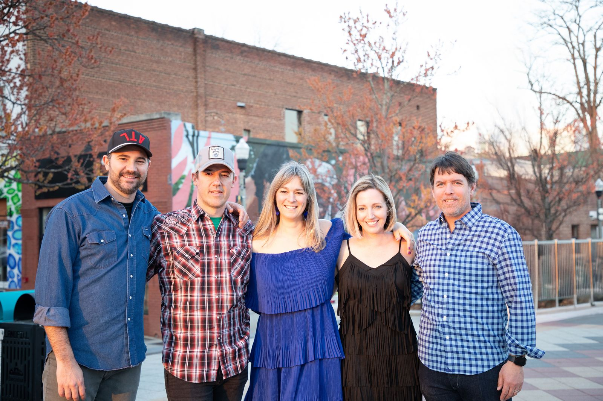
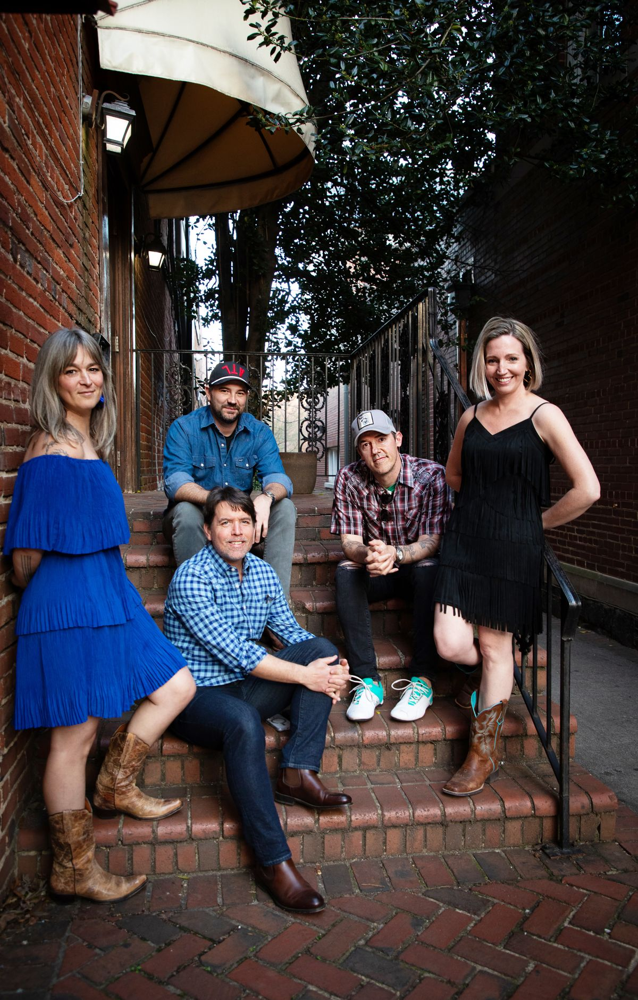

```{=html}
<div class="page-banner">
  
</div>
```

```{=html}
<div class="section-header-overlap about-overlap">
  <h2>About Us</h2>
</div>
<div class="about-section">

  <div class="about-content">
    <div class="about-photo">
      
    </div>
    <div class="about-text">
      <p>Formed in 2022, The Hamstrings are a five-piece band from Atlanta, GA. The band blends hits of the early 2000s with Country, Americana, and Southern Rock, along with a growing list of original songs.</p>
      <p>The Hamstrings have played at venues and festivals across the Atlanta area, including Eddie's Attic, Wild Heaven, The Lost Druid, Kirkwood Spring Fling, ATL Porches and Pies Festival, Oakhurst Porchfest, and the Inman Park Wine Stroll.</p>
    </div>
  </div>

  <div class="members-grid">
    <div class="member-card">
      <h4>Amanda Gillespie</h4>
      <p>Guitar, Mandolin, Vocals</p>
    </div>
    <div class="member-card">
      <h4>Kurt Dupuis</h4>
      <p>Guitar, Vocals</p>
    </div>
    <div class="member-card">
      <h4>Drea Jonsson</h4>
      <p>Violin</p>
    </div>
    <div class="member-card">
      <h4>Ian McCarthy</h4>
      <p>Drums</p>
    </div>
    <div class="member-card">
      <h4>Richard Cohen</h4>
      <p>Bass</p>
    </div>
  </div>

  <div class="about-photo-secondary">
    
  </div>

</div>
```
